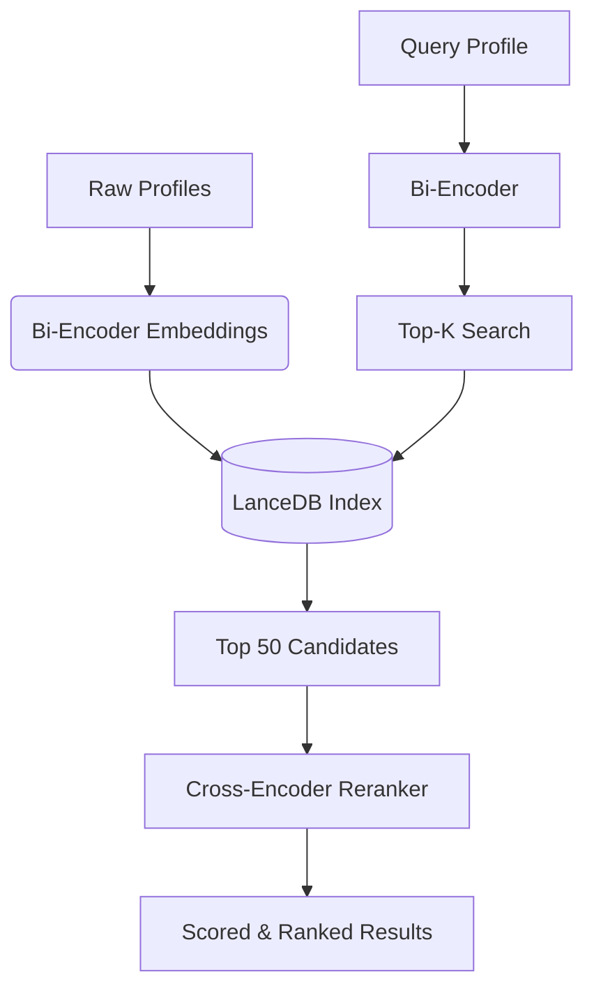

# Entity Resolution Reranker (Phase 2)

This repository holds the Phase 2 implementation of the Entity Resolution pipeline, focusing on **Cross-Encoder Reranking** and **Fine-Tuning**.

## Overview
Phase 2 builds upon the dual-encoder baseline from Phase 1 by implementing a two-stage retrieval and reranking architecture:
1. **Stage 1 (Bi-Encoder):** Retrieves the top-K highly probable candidate matches from a massive global pool using dense vector search (`gte-modernbert-base`).
2. **Stage 2 (Cross-Encoder):** A fine-tuned sequence-pair reranker (`Alibaba-NLP/gte-reranker-modernbert-base` & `ibm-granite/granite-3.0-reranker`) accurately scores and sorts the shortlist based on semantic context, formatting differences, and typographical corruptions.

## Architecture



## Setup & Installation

This project uses `uv` for ultra-fast dependency management and resolution. 

### Prerequisites
- Python >= 3.12, < 3.13
- `uv` package manager installed (`curl -LsSf https://astral.sh/uv/install.sh | sh`)

### Install Dependencies
```bash
uv sync
```

## Running the Pipeline

The project is built around reproducible script execution. Run the modules in sequence.

### 1. Data Downloading & Sourcing
Downloads massive datasets (US Census Surnames, SSA Baby Names, O*NET Job Titles, GLEIF Corporate data, and SEC EDGAR).
```bash
export PYTHONPATH=$PYTHONPATH:.
uv run python -m src.data.sources --download-all --output-dir data/raw/
```
*Note: The script automatically handles download resumption via `curl` for multi-GB sets like GLEIF.*

### 2. Global Pool Generation
Builds a unified 50,000-entity baseline pool mapped accurately to a global 6-tier ethnicity distribution constraint with structurally accurate metadata.
```bash
uv run python -m src.data.pool --output data/pool/base_pool.parquet
```

### 3. Data Corruption (Rule-Based & LLM)
Injects 28 unique structural, typographical, and heuristic errors into the pool, and uses the Gemini LLM for complex non-Latin string variations.
```bash
uv run python -m src.data.corrupt --pool data/pool/base_pool.parquet
uv run python -m src.data.corrupt_llm --pool data/pool/base_pool.parquet
```
*Requires `GEMINI_API_KEY` set in the environment.*

### 4. Negative Mining & Hard Boundaries
Generates 7 different strategies of difficult negatives to teach the model distinctions (Title swaps, Phonetic Neighbors, etc.). Also scrapes boundary candidates from a vector index for LLM arbitration.
```bash
uv run python -m src.data.negatives --pool data/pool/base_pool.parquet
uv run python -m src.data.boundary --pool data/pool/base_pool.parquet
```

### 5. Final Assembly & Splits
Merges, dedupes via MinHash, and guarantees strictly secure test-set isolation mathematically before undersampling to exact 50/50 balances for Model Fine-Tuning.
```bash
uv run python -m src.data.split
```

### 6. HF Hub Upload
Pushes the `train` and `val` parquet partitions directly to Hugging Face datasets. *Requires `HF_TOKEN`.*
```bash
uv run python -m src.models.upload_dataset
```

---

## Cloud Fine-Tuning (Modal)

To train the models on a remote cloud GPU (A10G), use the Modal CLI wrapper. This utilizes a `CurriculumTrainer` looping BCE Loss into Lambda Loss to fine-tune the selected Cross-Encoder target.

```bash
modal run src/models/finetune_modal.py::run_all
```

## Running Evaluations

To run the end-to-end multi-stage reranking execution over the evaluation subsets and compute standard ranking metrics (Recall@10, MRR, nDCG, F1@Threshold):
```bash
# Example execution:
uv run python -m src.eval.run_reranker \
  --stage1-model gte_modernbert_base_ft \
  --stage1-index /path/to/phase1/index \
  --reranker minilm_reranker \
  --eval-queries data/eval \
  --top-k-stage1 50 \
  --output results/001.json \
  --experiment-id 001

# Run the aggregator script to compile all .json outputs into CSV and Markdown tables
uv run python -m src.eval.aggregate
```
